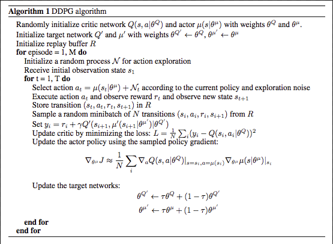
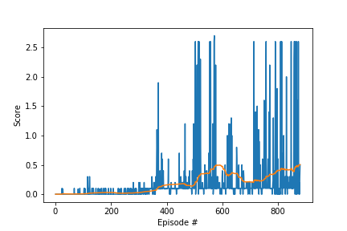

# Report
This report shortly summarizes the details of the deep reinforcement learning algorithm that was applied
to train multiple agents on Unity's **Tennis** environment. 

  


In this environment, two agents control rackets to bounce a ball over a net. If an agent hits the ball over the net, it receives a reward of +0.1.  If an agent lets a ball hit the ground or hits the ball out of bounds, it receives a reward of -0.01.  Thus, the goal of each agent is to keep the ball in play.

The observation space consists of 8 variables corresponding to the position and velocity of the ball and racket. Each agent receives its own, local observation.  Two continuous actions are available, corresponding to movement toward (or away from) the net, and jumping. 

The task is episodic, and in order to solve the environment, your agents must get an average score of +0.5 (over 100 consecutive episodes, after taking the maximum over both agents). Specifically,

- After each episode, we add up the rewards that each agent received (without discounting), to get a score for each agent. This yields 2 (potentially different) scores. We then take the maximum of these 2 scores.
- This yields a single **score** for each episode.

The environment is considered solved, when the average (over 100 episodes) of those **scores** is at least +0.5.

## Learning Algorithm

The agents are trained using a reinforcement learning technique called **Deep Deterministic Policy Gradients (DDPG)** to learn from the environment. The method has been shown to be well suited for solving challenging problems with continuous action spaces. For more information see [Continuous Control With Deep Reinforcement Learning](https://arxiv.org/pdf/1509.02971.pdf).

Pseudo code for the algorithm is shown in the following Figure.

  

The algorithm was adapted to allow both agents to act independently but a shared experience buffer was used to allow one agent to learn from the mistakes of the other and allow cooperation.

### Network Architecture

The **Actor** maps a state of the environment to action values via 3 fully connected **Linear** layers with **ReLU** activation. The final output layer yields 4 values with **tanh** activation. 

The **Critic** measures the quality of the actions via 3 fully connected **Linear** layers with **ReLU** activation. The single output of the last layer returns the estimated value of the current action.


### Hyperparameters
```
BATCH_SIZE = 128        # minibatch size
BUFFER_SIZE = int(1e6)  # replay buffer size
GAMMA = 0.99            # discount factor
LR_ACTOR = 1e-3         # learning rate of the actor 
LR_CRITIC = 1e-3        # learning rate of the critic
TAU = 6e-2              # for soft update of target parameters
WEIGHT_DECAY = 0        # L2 weight decay
UPDATE_EVERY = 1        # time steps between network updates
N_UPDATES = 1           # number of times training

eps_start = 6           # Noise level start
eps_end = 0             # Noise level end
eps_decay = 250         # Number of episodes to decay over from start to end
```

## Achieved Rewards
The agents were trained until an average score of +0.5 was achieved.  
  
The plot shows the average rewards and its rolling mean. The agent is clearly able to learn how to handle the environment successfully. The environment is solved in 779 episodes.

## Ideas for Future Work
No real effort was spent on optimizing the various hyperparameters. A grid-search can be used to investigate their influence on the solution. Because comparing and storing the results of a lot of different experiments gets more complex with an increasing number of hyperparameters, I plan to incorporate [sacred](https://github.com/IDSIA/sacred) to configure, organize, log and reproduce experiments with various hyperparameter. 
Another direction is to use a shared critic as this is said to enhance the stability of training.
